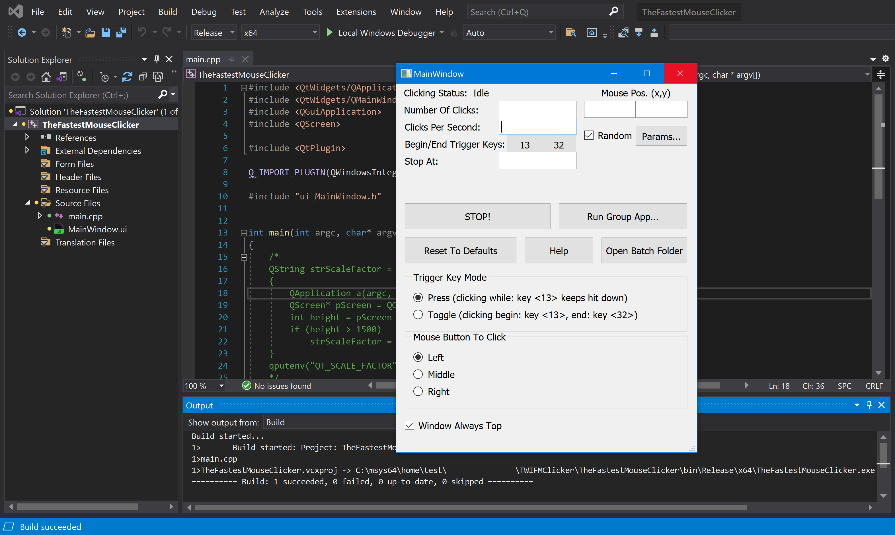

##  {{site.title}}

> Updated Jan 27 2023. [Teaser developer's screenshot for The Fastest Mouse Clicker v3.0.0.0 (cross-platform Qt edition)](index.html#TheFastestMouseClickerQt) added. [Mouse Polling Rate](index.html#Mouse_Polling_Rate) has been discussed. Anniversary 100 stars at [GitHub](https://github.com/windows-2048/The-Fastest-Mouse-Clicker-for-Windows){:target="_blank"}! Instead of [WTL](https://sourceforge.net/projects/wtl/){:target="_blank"}, the project migrates to [Qt](https://www.qt.io/){:target="_blank"} with full code rewrite and getting cross-platform (Windows/Linux/MacOS). [Screenshot](https://github.com/windows-2048/The-Fastest-Mouse-Clicker-for-Windows){:target="_blank"} with "secret" features added. Disambiguation note has been updated by the video.

### {{site.description_rich}}

<a name="QuickStart"></a>
## Quick Start

### [Official Download]({{site.download_link_main}}) ( [mirror]({{site.download_link_mirror}}) ) - The latest version&nbsp;{{site.app_version}}

SHA256(Install_TheFastestMouseClicker_2.6.1.0.exe)= eb6a79fcecb598b626b10d34951d6b51b7c56af25c340a59c208b879f3d2e151

<a name="ChangeLog"></a>
### What's New - The latest version&nbsp;{{site.app_version}}

"Single" application | "Group" application
----- | -----
 | 

#### ChangeLog

* Long waiting new feature FIXED POSITION CLICKING!
* Live current mouse position indicator.
* Fixed blurred GUI texts on 4K screens.
* Fixed wrong question about close old application during installation.
* Few minor bug fixes.

Found a bug or want a new feature? Create the [issue]({{site.source_issues_url}}){:target="_blank"}!

### Warning

> Please update your URLs:
> <br/>— <span style="color:DarkOrange;">https://sourceforge.net/projects/fast-mouse-clicker-pro/</span>
> <br/>— <span style="color:DarkOrange;">https://sourceforge.net/projects/fastclicker/</span>
> <br/>are obsolete and points to the wrong locations.
> <br/><span style="color:OliveDrab;"><b>Official site is here</b></span>.

### All future versions of The Fastest Mouse Clicker for Windows will be cross-platform and made with Qt

First, I have compiled a 64-bit minimalistic, static/static-runtime build of Qt v5.15.5 (LTS) made for Windows 7 to 11 under MSVC 2019 compiler.

Configure options:

```
C:\qt-src-5.15.5\configure -static -static-runtime -qt-zlib -qt-libjpeg -qt-libpng -qt-freetype -qt-pcre -qt-harfbuzz -no-sse4.1 -no-sse4.2 -no-avx2 -no-avx512 -no-pch -no-ssl -no-openssl -no-opengl -qpa windows -confirm-license -opensource -release -make libs -make tools -prefix c:/qt-5.15.5-static
```

Download [qt-5.15.5-static.zip](https://filedn.com/llBp1EbMQML0Hdv9A9SVo6b/qt-5.15.5-static.zip).

### Disambiguation

Fast or fastest mouse clicker may refer to a man clicking a hardware mouse by his own hands.
Typically such a man is called "quickest mouse clicker" or "quick mouse clicker".
Thus "fastest" do typically refer to a PC program while "quickest" refers to a human being.
Unprecedented record was done on May 6 2015, when Dylan A. from Las Vegas, Nevada, United States
clicked his mouse a total of 1051 times in 10 seconds, according to
[recordsetter.com](https://recordsetter.com/world-record/mouse-clicks-10/41199){:target="_blank"}.

<p>
TampaTec, famous Youtube blogger, has shown another real hardware mouse clicking, reaching clicking rate up to 16.5&nbsp;CPS (Clicks Per Second)!
He described how to win Gow&nbsp;2&nbsp;3 chainsaw duels, World's Fastest mouse clicking, clicker King, urban75.com.
His commenter Alexander Nielsen writes he achieves up to 100&nbsp;CPS consistently.
Rather Troy Liebe asserts his personal best is 139&nbsp;CPS with one finger (Brain Bashers).
In the video below, TampaTec shows the technique how that amazing results can be performed.
 <video style="outline:none; width:100%; height:100%;" controls preload="none" poster="videos/worlds-fastest-clicker-720p.jpg">
  <source src="videos/worlds-fastest-clicker-720p.mp4" type="video/mp4"/>
  Your browser does not support the video tag.
</video>
<a href="https://www.youtube.com/watch?v=r8Tlb3FrmhQ" target="_blank">Watch the original video "World's fastest mouse clicker- How to Win Gow Chainsaw duels!" in Youtube.</a>
</p>

## Table of Contents

* [Introduction](index.html#Introduction)
* [Features](index.html#Features)
* [Comparison](index.html#Comparison)
* [Technology](index.html#Technology)
* [Mouse Polling Rate](index.html#Mouse_Polling_Rate)
* [Source Code](index.html#SourceCode)
* [The Fastest Mouse Clicker v3.0.0.0 (cross-platform Qt edition)](index.html#TheFastestMouseClickerQt)
* [Help How To Use](index.html#HelpHowToUse)
* [Screenshots](index.html#Screenshots)
* [Partners](index.html#Partners)
* [Video Reviews From Our Users](index.html#Reviews_from_our_users)
* [Frequently Asked Questions (FAQ)](index.html#FAQ)
* [Downloads for all the versions](index.html#Downloads)
* [Contacts](index.html#Contacts)

<a name="Introduction"></a>
## Introduction

This is the official site to download various versions of {{site.app_name}}.
All the versions are shipped with SHA256 fingerprints to ensure you do download the genuine software.

Industry standard free open source mouse auto clicker emulates Windows clicks EXTREMELY QUICKLY via arrays of 1-1000 mouse events in Win32 <code><a href="https://docs.microsoft.com/en-us/windows/win32/api/winuser/nf-winuser-sendinput" target="_blank">SendInput()</a></code>, making up to 100 000 clicks per second. Brand new group clicking support, Command line for batch files, Auto-save on exit, Random clicking, App's window always topmost are supported. This compact standalone program is compiled and statically linked by gnu/gcc compiler and supports all the Windows 7 to 10 and Linux via Wine emulator. This clicker is the best for incremental games: Cooking, Soda, Minecraft etc.

The program is written in vanilla C++ with native Win32 API and linked statically thus it becomes a super-compact executable without external dependencies and can run on a bare Windows installation.

Free and fast, open source, full-featured, statically-linked mouse auto clicker for Windows written in vanilla C++. Uses hardware-limited arrayed Win32 <code><a href="https://docs.microsoft.com/en-us/windows/win32/api/winuser/nf-winuser-sendinput" target="_blank">SendInput()</a></code> calls to reach up to 100000 clicks/s. Supports command line, random clicks and record-play the sequences of clicks.

This is a professional tool for both quality assistance workflow and video game cheating.
Using keyboard keys (or mouse buttons) as a trigger, you can position the mouse, then hit a key to click up to 100000 times every second,
10 times faster then abandoned project at [sourceforge.net](https://sourceforge.net/projects/fastclicker/){:target="_blank"}.
{{site.app_name}} allows you to set an activation key to switch automatic clicking . There are two activation modes:
"press": the app will repeat clicking as long as the activation key is being pressed, and
"toggle": a Begin activation key press activates automatic clicking until an End activation key press deactivates it.
Of course, you can select arbitrary Begin and End trigger keys.
You also have the option to set a click number limitation. The mouse auto-clicker stops automatically when your desired number of clicks is reached.

If you desire to perform a Click Speed Test, go to elegant open source [implementation](https://top-10-mouse-auto-clickers.best/Click-Speed-Test-Online/){:target="_blank"} working right in your web browser.
The Click Speed Test is a free click per second test, which measures your mouse clicking speed in given time frame. Playing the Click Speed Test is easy and fun at the same time.
The test is suitable for all types of auto-clicking software as well as for direct human hands testing in all age groups, so do not worry if you are just a high school student or a person with a corporate job or PhD.
You do find Click Speed Test to be a useful tool while searching for ways to repeatedly click without using the mouse.
With {{site.app_name}} you just input the speed at which to click, and a keyboard button, and then while you hold that button down, the mouse is clicking for you automatically.
If you prefer to avoid "cheating", keep the clicking speed around 10-20 clicks/sec.

> New big version with FIXED POSITION CLICKING has been released!

{{site.app_name}} clicks the mouse automatically by emulating mouse clicking events.
The app has random in a box clicking feature, if you want that for some reason.
I plan to implement variative time interval between the clicks and allow you to choose a random interval range.
Hotkeys that trigger mouse clicks will be supported with almost every key modifiers, like SHIFT, CONTROL and ALT thus allow you to have SHIFT+\<Key\>, CONTROL+\<Key\> and ALT+\<Key\> triggers.
{{site.app_name}} is now suitable for Minecraft and Roblox auto-clicking, thanks to request from Xisuma user.
Also the program can be used as autoplayer for the game ClickerHeroes.
It can autoclick, activate skills, buy heroes and upgrades, and ascend and start all over.
All you need is to record and playback appropriate clicking sequence (see below).

You can auto-click the images, auto-fill the web forms, auto-submit a various type of requests with this auto-clicker.
For example, {{site.app_name}} can be used for scripting in Steam Summer Monster Minigame.
Another example, this program can be a bot for PTC websites like shorte.st, linkbucks, admy.link, etc. that automatically skips Ads.
The Group Clicker is a part of {{site.app_name}}. To run this extension simply click on "Run group app" button on the main window of {{site.app_name}}.
To return back to the previous app, click "Run single app" button.
The Group Clicker helps you to maintain separate sheet of data file from which Group Clicker can fetch data and use them row by row.
Also I plan to implement a schedule stored in a plain text file allowing you to auto-click on a webpage/URL at particular day and time.
You may add your own features by opening the solution file in Visual Studio and modifying source code.
The Windows installer opens corresponding folders by default.

<p>
Here is a short intro video that tells how to download and install {{site.app_name}}.
Also it shows basic quick-start guide to use automated clicks.
 <video style="outline:none; width:100%; height:100%;" controls preload="none" poster="videos/TFMCfW_intro.jpg">
  <source src="videos/TFMCfW_intro.mp4" type="video/mp4"/>
  Your browser does not support the video tag.
</video>
<a href="https://www.youtube.com/watch?v=gCpALY1WqmE" target="_blank">Watch intro to {{site.app_name}} in Youtube.</a>
</p>

There are a lot of use-cases of {{site.app_name}}.
Amateurs can use it for cheating in various web sites or video games such as Counter-Strike: Global Offensive (CS:GO), Candy Crush Saga, Roblox games, etc.
Professionals can use it for quality assistant and testing purposes because full support of command line in batch files, PowerShell scripts, etc.

<a name="Features"></a>
## Features

This is not a complete list of all the features of the program. I have just selected several of them most important
from the point of view of our users.
Because the Help text is not yet complete and does not reflect all the features implemented, feel free to create
an [issue]({{site.source_issues_url}}){:target="_blank"} to request a feature of your desire.

* The world's best click rate up to 100 000 clicks per second, increased by 10 times comparing with the predecessor application "Fast Mouse Clicker". The latest version with fixed performance issue is 100 times faster!

* Utilizes batch-array feature of <code><a href="https://docs.microsoft.com/en-us/windows/win32/api/winuser/nf-winuser-sendinput" target="_blank">SendInput()</a></code> and manipulates with <code><a href="https://docs.microsoft.com/en-us/windows/win32/api/synchapi/nf-synchapi-sleep" target="_blank">Sleep()</a></code> to reach the ultimate possible performance of mouse clicks on Windows.

* The Left, Middle, and Right mouse buttons are supported, they can be triggered for clicking by a key on the keyboard in a press or toggle mode.

* Arbitrary keyboard key can be selected to trigger the clicking process. Furthermore, an another mouse button can play a role of a trigger key.

* Different independent trigger keys to begin/end the clicking in toggle mode.

* The program works fine even if it is minimized and also it operates on an arbitrary desktop area. The program can stop to click automatically, if a certain number of clicks is given by end-user.

* This is free, open source application without ads, viruses, trojans, malware, etc. forever.

* The program has built-in updater service under construction that may perform additional scientific tasks when your CPU is idle with very tiny CPU and Internet usage. See source code of the installer. The application uninstalls clearly and is NOT a virus or malware. You may switch to the installers without update service and back with [in any moment](https://github.com/windows-2048/The-Fastest-Mouse-Clicker-for-Windows/blob/master/InnoSetupDownloader/README.md){:target="_blank"}.

* The application can be used on a bare system, it does not depend on .NET Framework or any other external library as "Speed AutoClicker", "Fast Clicker", etc.

* Command line has been supported: TheFastestMouseClicker.exe -c <clicks per second> -t <trigger key> -s <stop at> -m <trigger key mode> -b <mouse button to click>, where <trigger key mode> can be 'press' or'toggle' and <mouse button to click> can be 'left', 'middle', or 'right'. One may specify any part of arguments; unspecified or unrecognized values will be treated as defaults (see them by running the app and pressing 'Reset to defaults' button.

* Button "Batch folder" has been added to open a directory with *.bat files quickly; it simplifies command line usage a lot.

* Fractional values for clicks/s parameter are supported. For example, 0.5 clicks/s equals to 1 click every 2 seconds.

* Random clicking has been implemented. Just click the "Batch folder" button and see remarks in the *.bat files reside there in order how to use command line arguments and to enable random clicking.

* Group clicking (record/play the sequences of clicks) supported via additional application since v.2.5.3.2. You can quickly switch between the applications by clicking the "Run group app"/"Run single app" button.

* Window Always Top checkbox to keep the app's window topmost.

* Manual options/settings editing as a bonus to automatic saving: just open C: \ Users \ \<YourWindowsUser\> \ AppData \ Roaming \ TheFastestMouseClicker \ TheFastestMouseClicker \ settings.dat
in any plain text editor (you might change sub-path TheFastestMouseClicker during installation).

<a name="Comparison"></a>
## Comparison

What about other auto-clickers and their features?
Here is the table that summarizes all the key features of 3 most downloaded programs.

Feature | [Fast Mouse Clicker](https://sourceforge.net/projects/fastclicker/){:target="_blank"} | [Auto<wbr/>Clicker](https://sourceforge.net/projects/orphamielautoclicker/){:target="_blank"} | The Fastest Mouse Clicker for Windows
------- | ------- | -------
Open source project | No | **Yes** | **Yes**
Regular updates and bug fixes | No | No | **Yes**
Arbitrary trigger key for clicking | **Yes** | **Yes** | **Yes**
Mouse button as trigger key for clicking | **Yes** | No | **Yes**
Independent trigger keys in toggle mode | No | **Yes** | **Yes**
All the clicking parameters auto-save | No | **Yes** | **Yes**
Group clicking (record-play the sequences of clicks) | No | **Yes** | **Yes**
Command line support in batch files | No | No | **Yes**
Button to open a folder with all the batch files | No | No | **Yes**
Button to reset all the clicking parameters to default values | No | No | **Yes**
Random clicking in a specified rectangle | No | No | **Yes**
Hardware-limited fastest clicking via arrayed <code><a href="https://docs.microsoft.com/en-us/windows/win32/api/winuser/nf-winuser-sendinput" target="_blank">SendInput()</a></code> | No | No | **Yes**
Side DLL/runtime independent (runs on bare Windows) | No | No | **Yes**
Checkbox to keep the app window always Top | No | No | **Yes**

The Fastest Mouse Clicker for Windows wins this competition because its code is a further developing of the rest 2 popular apps.

<a name="Technology"></a>
## Technology

Unlike other auto-clickers that use obsolete <code><a href="https://docs.microsoft.com/en-us/windows/win32/api/winuser/nf-winuser-mouse_event" target="_blank">mouse_event()</a></code>
system call from C/C++ source or un-arrayed <code><a href="https://docs.microsoft.com/en-us/windows/win32/api/winuser/nf-winuser-sendinput" target="_blank">SendInput()</a></code> from C#/.Net source, The Fastest Mouse Clicker for Windows uses
<i>arrayed</i> <code><a href="https://docs.microsoft.com/en-us/windows/win32/api/winuser/nf-winuser-sendinput" target="_blank">SendInput()</a></code> with specially prepared <i>arrays</i> of mouse events:

<pre><code title="Arrayed SendInput() example">
UINT nCntExtra = (nCnt - 1) * 2; // reserved index for DOWN, UP

for (UINT iExtra = 0; iExtra < nCntExtra; iExtra += 2)
{
    input[1 + iExtra].type = INPUT_MOUSE;

    input[1 + iExtra].mi.dx = dx;
    input[1 + iExtra].mi.dy = dy;

    input[1 + iExtra].mi.mouseData = dwData;
    input[1 + iExtra].mi.time = 0;
    input[1 + iExtra].mi.dwExtraInfo = dwExtraInfo;

    ...
}

...

UINT ret = SendInput(1 + nCntExtra, input, sizeof(INPUT));
</code></pre>

The size of the <i>arrays</i> is carefully computed based on the click rate given by end-user. To avoid system event buffer
overflow, the time in <code><a href="https://docs.microsoft.com/en-us/windows/win32/api/synchapi/nf-synchapi-sleep" target="_blank">Sleep()</a></code> is selected properly according the size of the <i>array</i>.

The GUI of the application seems archaic, but it is made by very base Win32 system calls
to avoid performance degradation caused by
high-level third-side libraries such as [Qt](https://www.qt.io/){:target="_blank"} or slow managed code in frameworks like C#/.Net.
For example, <code><a href="https://docs.microsoft.com/en-us/windows/win32/api/winuser/nf-winuser-getasynckeystate" target="_blank">GetAsyncKeyState()</a></code> is used to detect the trigger keys pressed by end-user:

<pre><code title="Base GetAsyncKeyState() example">
if (!doToggle)
{
    if (toggleState == 0 && GetAsyncKeyState(atoi(triggerText)))
        toggleState = 1;
    ...
}
else
{
    if (toggleState == 0 && GetAsyncKeyState(atoi(triggerText)))
        toggleState = 1;
    ...
}
</code></pre>

Another benefit of such an approach is compact, statically-linked executable without any external dependencies.

When end-user selects low click rates, actual size of the <i>array</i> of mouse events in <code><a href="https://docs.microsoft.com/en-us/windows/win32/api/winuser/nf-winuser-sendinput" target="_blank">SendInput()</a></code>
is set to 1 and number of clicks per second is regulated by <code><a href="https://docs.microsoft.com/en-us/windows/win32/api/synchapi/nf-synchapi-sleep" target="_blank">Sleep()</a></code> only.
But when end-user selects high click rates, the size of the <i>array</i> becomes significant. In rare circumstances, it may lead to freeze the whole Windows GUI.
To avoid that, the helper thread is created to scan <code><a href="https://docs.microsoft.com/en-us/windows/win32/api/winuser/nf-winuser-getasynckeystate" target="_blank">GetAsyncKeyState()</a></code> independently in order end-user has requested to stop the clicking
and force <code><a href="https://docs.microsoft.com/en-us/windows/win32/api/winuser/nf-winuser-blockinput" target="_blank">BlockInput()</a></code> because mouse event buffer may be full:

<pre><code title="Helper thread with BlockInput() example">
DWORD WINAPI MyThreadFunction(LPVOID lpParam)
{
    while (true)
    {
        if (GetAsyncKeyState(atoi(triggerText2)))
        {
            ...
            BlockInput(TRUE);
            Sleep(100);
            BlockInput(FALSE);
            ...
            SetMsgStatus(hWnd, GetDlgCtrlID(statusText)
                , "idle");
        }

        Sleep(10);
    }

    return 0;
}
</code></pre>

To be more compatible with older versions of Windows, {{site.app_name}} utilizes base Win32 API for widget creation.
It uses traditional Windows approach to re-draw all the widgets in a Windows event loop.
To update the view of a particular widget, an event is being sent to that widget in the main thread and
incoming call is being passed to event loop handler where actual re-draw occurs.

First, we declare a <code><a href="https://docs.microsoft.com/en-us/previous-versions/windows/desktop/legacy/ms633573(v=vs.85)" target="_blank">WindowProc()</a></code> callback function.
Second, we register a main window class with that callback by <code><a href="https://docs.microsoft.com/en-us/windows/win32/api/winuser/nf-winuser-registerclassa" target="_blank">RegisterClass()</a></code>.
And finally we enter an infinite loop inside event callback function.

<pre><code title="Windows event loop to re-draw the widgets">
LRESULT CALLBACK winCallBack(
    HWND hWin
    , UINT msg
    , WPARAM wp
    , LPARAM lp
    );

...

// Initializing the window class
windClass.style         = CS_HREDRAW | CS_VREDRAW;
windClass.lpfnWndProc       = winCallBack;
windClass.cbClsExtra        = 0;
windClass.cbWndExtra        = 0;
windClass.hInstance     = instanceH;
windClass.hIcon         = LoadIcon(
                            windClass.hInstance
                            , MAKEINTRESOURCE(101)
                            );
windClass.hCursor           = LoadCursor(
                            NULL
                            , IDC_ARROW
                            );
windClass.hbrBackground = (HBRUSH)GetStockObject(
                            WHITE_BRUSH
                            );
windClass.lpszClassName = "The Fastest Mouse Clicker "
                            "for Windows";

//Registering the window class
RegisterClass(&windClass);

...

LRESULT CALLBACK winCallBack(
    HWND hWin
    , UINT msg
    , WPARAM wp
    , LPARAM lp
    )
{
    HDC dc;
    PAINTSTRUCT ps;
    int local_status = 0;
    switch (msg)
    {
    case WM_COMMAND:
        switch(LOWORD(wp))
        {
        case RESET_BTN:

        ...
    ...
}
</code></pre>

From the other hand, to be more compatible with latest versions of Windows and newest hardware such as professional
<a href="https://www.pcmag.com/picks/the-best-4k-monitors" target="_blank">4K displays</a>
and gaming monitors,
font size adjusting is performed on application start utilizing both variable font size and embedded
<a href="https://docs.microsoft.com/en-us/windows/win32/hidpi/setting-the-default-dpi-awareness-for-a-process" target="_blank">high DPI</a> xml manifest.

<pre><code title="Support for 4K displays in C++ code">
struct _Sc
{
    int factor;
    _Sc() : factor(1)
    {
        int h, v;
        GetDesktopResolution(h, v);
        if (v > 1440)
            factor = 2;
    }
} _sc;

int Sc(int x)
{
    return x * _sc.factor;
}

...

statusText = CreateWindow(
    "Static"
    , "clicking status: idle"
    , WS_VISIBLE | WS_CHILD
    , Sc(5)
    , Sc(1)
    , Sc(410)
    , Sc(35)
    , hWnd
    , 0
    , 0
    , 0
    );
</code></pre>

The application embedded xml manifest contains a section with high DPI awareness.

<pre><code title="Support for 4K displays in xml manifest">
  ...

&lt;asmv3:application&gt;
  &lt;asmv3:windowsSettings&gt;
    &lt;dpiAware xmlns="http://schemas.microsoft.com/SMI/2005/WindowsSettings"&gt;
        true
    &lt;/dpiAware&gt;
    &lt;dpiAwareness xmlns="http://schemas.microsoft.com/SMI/2016/WindowsSettings"&gt;
        system
    &lt;/dpiAwareness&gt;
  &lt;/asmv3:windowsSettings&gt;
&lt;/asmv3:application&gt;

  ...
</code></pre>

There are much more programmatic tricks I used to achieve outstanding performance, compatibility and look-n-feel.
If you want to discover them, you have to study source code yourself.

<a name="Mouse_Polling_Rate"></a>
## Mouse Polling Rate

Apart of mouse event emulation techniques, it is important to know about so called Mouse Polling Rate.
Mouse Polling Rate is the frequency at which your mouse signals the computer its whereabouts on the screen.
For instance, a mouse with its polling rate set to 125Hz will refresh its location on screen 125 times per second.
The higher the polling rate, the more "real-time" the cursor movement that you see on the screen will be.
Depending on mouse manufacturer, your Mouse Polling Rate may vary from some 100Hz to up to 1000Hz and more.

From what you’ve learned so far about polling rates, it’s easy to see why a higher polling rate would benefit a gaming mouse.
But note, the difference between 125Hz and 500Hz is much more significant than between 500Hz and 1000Hz.
In the latter case you get benefit of a just 1ms. Thus there is no reason to buy an expensive mouse with polling rate much greater than 500Hz.
Moreover, it has been found that high polling rates of 1000Hz or more tend to put a heavier load on the CPU.

Here I leave an intriguing thoughts on mouse polling rates and auto-clicker software, came from one of the fan user of {{site.app_name}}.

Hey Masha, Thanks for the reply, I saw the download on Majorgeeks, but I believe I downloaded it from your site to make sure I had the latest version, that's how I got your email address too. Anyway, the "polling rate" is basically how fast your mouse sends signals to your PC of it's current location, it's usually measured in Hz, my Logitech software has options for 125 Hz, 250 Hz, 500 Hz, and 1000 Hz, as does most other mouse gaming software and there are a few utilities that can change it the polling rate too, 1000 Hz has been the limit for a long time, but now companies like Razer, has a mouse with a polling rate of 8000 Hz, some other 2000 Hz .. I'm just looking for something that will achieve over 1000 Hz. Basically, the higher the polling rate, the less "mouse lag" while gaming. I also do things like set the process priority level for my mouse driver/software process to "above normal" or "high" to get more responsiveness from it.

I downloaded a couple of other mouse programs like yours, one I tried so far is "Speed Auto Clicker" .. it's okay, it does do what I want as far as "click speed", but I don't like the button assignment options, you can only assign hotkeys to "keyboard buttons", I have a mouse with 10 buttons, I want the option on the fly (on my mouse). I tried contacting him, email was sent back undeliverable and program hasn't been updated in a while, so it's development has probably ended.

I'm going to try yours shortly, I also tried the other I downloaded, or lets says I opened it, it's called AutoFire and it's kinda weird ... not sure it will do what I want in the games I play. Plus... I am hoping none of these get detect as cheats... I have a perfect record with Valve Software / Steam, had my acct. for 19 yrs, don't want to loose it!

Hopefully your program while do what I want ... what I "really want" is a utility that just makes "one mouse click" equal a higher number, like "3 mouse clicks, or 5, 10, etc..", kinda like how you can set your scroll wheel to either scroll 1 line at a time, or 2 lines, or 3 lines at a time. Same thing, I just want that option for my mouse clicker (left click).

None I downloaded have the polling rate options, I do have 2 utilities that adjust polling rates, but they are from 2010 and 2011, not sure if they'll work with modern OS's, plus they do not exceed 1000 Hz and my Logitech G-Hub software allows me to set @ 1000 Hz, but I want higher! I was thinking about seeing if I can edit the polling rate utility from 2010, its a small simple utility and hopefully I can edit the values. I'm no developer, but I have played around with it some and successfully edited and altered programs / drivers, when WinXP Pro x64 bit first came out, I was using it, I actually beta tested it for 14 months before it's release too, but XP Pro x64 was the "first x64 bit" OS to hit the shelves, in OEM form, but anyone could buy it, I got mine free for testing, but driver support was extremely limited and I had a high end gaming machine, most of my hardware and add-ons had driver support either from the manufacturer, like nVidia released x64 bit drivers, others had native support from the OS, but my favorite audio card by Creative would not work and I hated onboard audio back then, it took me about 4 days, but I was able to modify some of the .inf and .sys files and got the "audio" to work, none of the other features worked and I had no equalizer, etc..

But I did get the sound to work. I wish I got in to it more, I'm pretty good with computers, especially on the hardware side, I've been building them since 1996, my current rig I built cost me $3,800.00 to build, but some of that cost was inflated prices due to graphics card shortages, I paid $1,000.00 for a card that would normally retail @ $399.99. But the rest was priced fairly I believe, I've got a 12 core 5900x Ryzen processor, 64gb of Corsair RGB 3600 mhz ddr4, 1tb Samsung 980 Pro NVMe SSD, Geforce 3060 Ti OCX, ASUS TUF Gaming x570 Plus WiFi motherboard, etc... but I'm good a figuring out stuff on PC's on the software side, like manually removing stubborn trojans, malware, ransomeware, etc..

Anyway, enough babbling, I'll let you know what I think of it and if it does what I wanted or not... thanks for your reply!

G. Kelly Irish


<a name="SourceCode"></a>
## Source Code

Complete source code with comments is shipped with Windows installer or can be watched on
[Github](https://github.com/windows-2048/The-Fastest-Mouse-Clicker-for-Windows){:target="_blank"}
and [Gitlab](https://gitlab.com/mashanovedad/The-Fastest-Mouse-Clicker-for-Windows){:target="_blank"}.

<a name="TheFastestMouseClickerQt"></a>
## The Fastest Mouse Clicker v3.0.0.0 (cross-platform Qt edition)

Migration to cross-platform Qt edition of {{site.app_name}} is in successive progress. New application will get version 3.0.0.0 and will be called
"The Fastest Mouse Clicker for \<OS\> (cross-platform Qt edition)", where \<OS\> is "Windows", "Linux", "MacOS (M1)".
QtDesigner \*.ui makeup is ready today. I tease you to look how pleasant and beautiful The Fastest Mouse Clicker v3.0.0.0 will appear
on your PC screen. Full native support of 4K and Retina displays is here. As always, the application is statically linked and does not
require 3rd-party DLL or OS component. Meanwhile, among Windows lineage, all the systems from Windows&nbsp;7 to Windows&nbsp;11 are supported.
Note though, 32-bit OS builds (typically for Windows) have gone to the history. New app will be 64-bit only for all the platforms. Standby!



<a name="HelpHowToUse"></a>
## Help How To Use

YOU CAN START THE AUTO-CLICKING AT ANY MOMENT BY PRESSING THE &lt;trigger key&gt; (13 = Enter). Reading the entire Help is optional.

THE FIELDS YOU CAN NOT MODIFY.

&lt;clicking status&gt; or &lt;random clicking status&gt;, the topmost text field, is either getting 'idle' or 'clicking'.
 It is shown as &lt;random clicking status&gt; only when all the rectangle sizes to click randomly inside it are specified in the command line correctly.
 Just press the \[Batch folder\] button and see the remarks in file run_clicker_with_random_clicking.bat.

&lt;number of clicks&gt;, the top text field, indicates total number of clicks performed.

THE FIELDS YOU CAN MODIFY (CALLED THE CLICKING PARAMETERS: THEY COULD BE SET FROM THE COMMAND LINE TOO, SEE BELOW).

&lt;clicks per second&gt;, the middle text field, is the frequency of the clicks measured in clicks per second.
 This frequency can be as high as one hundred thousands (100000) clicks per second.
 FRACTIONAL frequences are supported. For example, 0.5 corresponds to 1 click every 2 seconds, 0.25 - to 1 click every 4 seconds, etc.

&lt;begin/end trigger keys&gt;, below that, are the keyboard keys to trigger the mouse events. Just click on them and press an arbitrary key (or hit a mouse button).
 That key will then trigger the mouse clicks when it remains pressed. If you just press and release the key, only few clicks should be made.
 This behavior corresponds to &lt;trigger key mode&gt; = 'press', see how it changes on 'toggle' value below.
 Default number shown in the button, 13, is the 'Enter' key code (for example, 32 is the 'Space' key code, 112 is the 'F1' key code, etc.
 For all the key codes see [Windows docs](https://docs.microsoft.com/en-us/windows/win32/inputdev/virtual-key-codes){:target="_blank"}.

&lt;stop at&gt;, the lower text field, is the number of clicks before the clicking will automatically stop.
 0 is the default and means infinity, i.e. clicking will never stop.

&lt;trigger key mode&gt; is a radio-button group, you can select either 'press' or 'toggle' mode of clicking.
 In the 'press' mode (default), the mouse events are emitted only when the corresponding trigger key is kept pressed.
 In the 'toogle' mode, the mouse events are emitted between subsequent short hits to the &lt;begin trigger key&gt; and &lt;end trigger key&gt;.

&lt;mouse button to click&gt; is a radio-button group too, you can select either 'left', 'middle' or 'right' mouse button that will generate the clicks.

Note 1: You can't have the same mouse button be the trigger and clicker.
<br/>Note 2: You can't change the &lt;trigger key&gt; if you chose the left mouse button; you must press the \[Reset to defaults\] button.
<br/>Note 3: The &lt;trigger key&gt; still works when this program is minimized. You must close the program to stop a &lt;trigger key&gt; from clicking.

*NEW* All the clicking parameters are saved automatically between application run-times.

ADDITIONAL BUTTONS AND FEATURES.

\[STOP!\] button stops toggled clicking mandatory.
<br/>\[Help\] button displays this help window.
<br/>*NEW* \[Reset to defaults\] button sets all the clicking parameters back to their default values.
<br/>*NEW* \[Batch folder\] button opens the folder in File Explorer where all the batch files reside typically.
<br/>*NEW* To get help on the command line arguments, just press the \[Batch folder\] button and see the remarks in \*.bat files you find there.
<br/>*NEW* Independent keys for &lt;trigger key mode&gt; = 'toggle': if &lt;begin trigger key&gt; begins the clicking, then &lt;end trigger key&gt; stops it.
<br/>*NEW* &lt;Window Always Top&gt; checkbox: if checked, keeps the app's main window at topmost of others.
<br/>*BRAND NEW* The 'Run group app' button: record/play the sequences of mouse clicks.

<a name="Screenshots"></a>
## Screenshots

### Screenshots for the latest version 2.6.1.0 are here!

* The Fastest Mouse Clicker for Windows version 2.6.1.0: introduce the "FIXED POSITION CLICKING" feature.


* The Fastest Mouse Clicker for Windows version 2.6.1.0: the brand new Group App in details.


* The Fastest Mouse Clicker for Windows version 2.6.1.0: running under Wine 4.0.2/Linux(CentOS 6).


* The Fastest Mouse Clicker for Windows version pre-2.5.x.x family: what's old but important.


* The Fastest Mouse Clicker for Windows version 2.6.1.0: completely hand-made art by the clicker application.


* The Fastest Mouse Clicker for Windows version 2.6.1.0 - Main app with batch folder that reveals "secret" features.


<a name="Partners"></a>
## Partners

* [Bytesin](https://www.bytesin.com/software/The-Fastest-Mouse-Clicker-for-Windows/){:target="_blank"}, Your Daily Dose of Bytes

* [Chocolatey](https://chocolatey.org/packages/fastest-mouse-clicker){:target="_blank"}, The Package Manager for Windows

* [Github](https://github.com/windows-2048/The-Fastest-Mouse-Clicker-for-Windows){:target="_blank"}, Built for Developers

* [Gitlab](https://gitlab.com/mashanovedad/The-Fastest-Mouse-Clicker-for-Windows){:target="_blank"}, Simplify Your Workflows

* [Lamerkomp](https://lamerkomp.ru/load/sistemnye_utility/avtoklikery/the_fastest_mouse_clicker_for_windows/56-1-0-6328){:target="_blank"}, Download Freeware without Registration

* [Majorgeeks](http://m.majorgeeks.com/files/details/the_fastest_mouse_clicker_for_windows.html){:target="_blank"}, It's Geekalicious

* [OSDN](https://osdn.net/projects/fastest-clicker/){:target="_blank"}, Develop and Download Open Source Software

* [Softpedia](https://www.softpedia.com/get/System/OS-Enhancements/The-Fastest-Mouse-Clicker-for-Windows.shtml){:target="_blank"}, Free Downloads Encyclopedia

* [Top 10 Mouse Auto Clickers Most Honest Rating](https://top-10-mouse-auto-clickers.best/The-Fastest-Mouse-Clicker-for-Windows/index.html){:target="_blank"}, The Most Honest Rating of Existing Autoclickers

* [Uptodown](https://the-fastest-mouse-clicker-for-windows.en.uptodown.com/windows/download){:target="_blank"}, Download Discover Share

<a name="Reviews_from_our_users"></a>
## Video reviews from our users

<p>
Wolf0626, young vlogger shows how he downloads, installs and runs The Fastest Mouse Clicker for Windows on his PC.
 <video style="outline:none; width:100%; height:100%;" controls preload="none" poster="videos/VideoReview_Wolf0626.jpg">
  <source src="videos/VideoReview_Wolf0626.mp4" type="video/mp4"/>
  Your browser does not support the video tag.
</video>
<a href="https://www.youtube.com/watch?v=f92nqHFxcmk" target="_blank">Watch the review video "How to Download the fastest mouse clicker for windows!!!" in Youtube.</a>
</p>

<p>
BullyWiiPlaza, experienced youtuber shows how he cheats extra scores with The Fastest Mouse Clicker for Windows in his mature gameplay.
 <video style="outline:none; width:100%; height:100%;" controls preload="none" poster="videos/VideoReview_BullyWiiPlaza.jpg">
  <source src="videos/VideoReview_BullyWiiPlaza.mp4" type="video/mp4"/>
  Your browser does not support the video tag.
</video>
<a href="https://www.youtube.com/watch?v=weoSf-CppZU" target="_blank">Watch the review video "[Yu-Gi-Oh! Duel Links] The Fastest Auto Clicker for Windows Gameplay" in Youtube.</a>
</p>

<a name="FAQ"></a>
## Frequently Asked Questions (FAQ)

### Does the clicker work when its main GUI window is minimized?

Yes, it does. Trigger keys are being intercepted and mouse events are being emitted
regardless the application window state is: normal, maximized, minimized, focus, blur, etc.

### What if I want to emulate 2 clicks within every 3 seconds, what the 'clicks per second' parameter should be?

You have to type 0.67 inside 'clicks per second' input field. Just click on it, delete previous value, and type new one.

### What is minimal Windows version supported?

Your PC must have Windows 7 or later. Don't use Windows XP. Better use Windows 10. Windows 11 is also supported.

### When I open many windows simultaneously on my desktop and start to emulate mouse clicks, I lose the GUI window of the app. Why?

That's because you forget about checkbox named "Window Always Top". It is specially designed to prevent such a situation.
Once you check it, main GUI window of the program will be layered always topmost (above all the other windows on your desktop).

### What about sequences of clicks?

Work with sequences of clicks is supported since v2.5.x.x. To avoid GUI complication, second "Group" application is implemented.
To run that app from main "Single" app just press a "Run group app" button. To return to main app press "Run single app" button.

### Does your program run on bare Windows, like Windows Home on a laptop just from store?

Yes. Unlike all other auto-clickers this app is statically linked and has no external dependencies (e.g. "The application was unable to start correctly (0xc000007b)" from incorrect linkage against MSVC run-time DLLs).

### Does your app support multiple subsequent mouse clicks?

Yes, it does. But the Help text is not ready yet. Although the GUI is simple and intuitive
and based on the one of the most famous auto-clickers in the past. To do subsequent clicking,
just run the main app, click the "Run group app" button and see the "Quick Help" area just below the center of the window.

### I observe many other auto-clickers do not support 4K displays. What about your one?

I did that work essentially and have fixed that issue by adjusting font sizes on the fly and embedding a proper xml manifest into app binary.

### Is this FAQ nearly complete?

Oh no :) It has been just started. Feel free to ask your question via email. See the Contacts chapter below.

<a name="Downloads"></a>
## Downloads for all the versions

* Version 2.6.1.0 Windows installer (32/64-bit): [Install_TheFastestMouseClicker_2.6.1.0.exe](https://filedn.com/llBp1EbMQML0Hdv9A9SVo6b/Install_TheFastestMouseClicker_2.6.1.0.exe) ( [mirror](https://ipfs.io/ipfs/QmP4v8nCnfbYzP643BmHeuYgiX1GhbiioiEu3zjzVnkgi1/Install_TheFastestMouseClicker_2.6.1.0.exe) )

SHA256(Install_TheFastestMouseClicker_2.6.1.0.exe)= eb6a79fcecb598b626b10d34951d6b51b7c56af25c340a59c208b879f3d2e151

* Version 2.5.4.0 Windows installer (32/64-bit): [Install_TheFastestMouseClicker_2.5.4.0.exe](https://gitlab.com/mashanovedad/The-Fastest-Mouse-Clicker-for-Windows/-/raw/master/WindowsInstaller/Install_TheFastestMouseClicker_2.5.4.0.exe?inline=false)

SHA256(Install_TheFastestMouseClicker_2.5.4.0.exe)= 738058b7dc1e95b963860e5797bab5761a8801bda90feb0311c038e98477cc31

* Version 2.5.3.3 Windows installer (32/64-bit): [Install_TheFastestMouseClicker_2.5.3.3.exe](https://gitlab.com/mashanovedad/The-Fastest-Mouse-Clicker-for-Windows/-/raw/master/WindowsInstaller/Install_TheFastestMouseClicker_2.5.3.3.exe?inline=false)

SHA256(Install_TheFastestMouseClicker_2.5.3.3.exe)= 55bde08c90989d4dbeb9602d93b3c7bcb3645135281e1b64c32d59521799836b

* Version 2.5.3.2 Windows installer (32/64-bit): [Install_TheFastestMouseClicker_2.5.3.2.exe](https://gitlab.com/mashanovedad/The-Fastest-Mouse-Clicker-for-Windows/-/raw/master/WindowsInstaller/Install_TheFastestMouseClicker_2.5.3.2.exe?inline=false)

SHA256(Install_TheFastestMouseClicker_2.5.3.2.exe)= 58854af05b2024ce39078d828228d512548212fc3283c511c1a16c19c844bf06

* Version 2.5.1.0 Windows installer (32/64-bit): [Install_TheFastestMouseClicker_2.5.1.0.exe](https://gitlab.com/mashanovedad/The-Fastest-Mouse-Clicker-for-Windows/-/raw/master/WindowsInstaller/Install_TheFastestMouseClicker_2.5.1.0.exe?inline=false)

SHA256(Install_TheFastestMouseClicker_2.5.1.0.exe)= cb13c125212feb8241f4a4258919781d546084f0f19862ad11f07a3e95004577

* Version 2.0.0.0 Windows installer (32/64-bit): [Install_TheFastestMouseClicker_2.0.0.0.exe](https://gitlab.com/mashanovedad/The-Fastest-Mouse-Clicker-for-Windows/-/raw/master/WindowsInstaller/Install_TheFastestMouseClicker_2.0.0.0.exe?inline=false)

SHA256(Install_TheFastestMouseClicker_2.0.0.0.exe)= c12fbeee1a12ce598bcd1f6b39872abcbcfc89d2b21d235882ca479fd26a324a

<a name="Contacts"></a>
## Contacts

#### Copyright (c) 2016-2022 by [Open Source Developer Masha Novedad](https://windows-2048.github.io){:target="_blank"}
